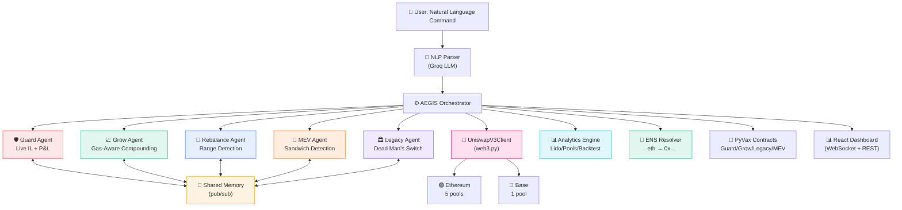

# 🛡️ AEGIS — Autonomous Wallet Guardian

    

> **One command. Five AI agents. Real on-chain Uniswap V3 data. Zero Solidity.**

AEGIS deploys 5 coordinated AI agents that **protect**, **grow**, **rebalance**, **shield from MEV**, and **inherit** your Uniswap V3 LP positions — with **live on-chain integration** querying real pool state from Ethereum Mainnet and Base.

```
"Protect my Uniswap positions, compound my fees, shield me from sandwich attacks, and if I disappear for 30 days, send everything to family.eth."
```

→ Five agents spawn. Real pool data flows. MEV protection activates. Your wallet is guarded.

## ⚡ What Makes AEGIS Different?

Most hackathon projects monitor one metric or solve one problem. AEGIS is different:

| | Other Projects | AEGIS |
|---|---|---|
| **Data** | Simulated / mock data | **Live on-chain** — real `slot0()`, `feeGrowthGlobal`, `eth_gasPrice` |
| **Scope** | Single-agent, single-problem | **5 coordinated agents** solving 5 distinct LP problems |
| **Intelligence** | Static rules | **NLP-configured** strategies + agent reasoning logs explaining every decision |
| **MEV Protection** | None | **Sandwich attack detection** via tick swing analysis + front-run detection |
| **Resilience** | Single RPC, breaks on rate limit | **6 fallback RPCs** with automatic rotation on 429 errors |
| **Chains** | Single chain | **Multi-chain** — Ethereum + Base with live switching |
| **Lido** | No stETH support | **2 Lido pools** monitored (wstETH/ETH + stETH/ETH) |
| **ENS** | No ENS support | **ENS name resolution** for beneficiary addresses |
| **Analytics** | None | **Lido yield comparison**, **cross-pool allocation**, **historical backtesting** |
| **Uniswap API** | None | **Real swap quotes** from Uniswap Developer Platform Trading API |

## 📸 Demo

| Landing Page | Live Dashboard |
|:---:|:---:|
|  |  |
| **Threat Detection** | **Out-of-Range Alert** |
|  |  |

### 🎥 Record a 60-Second Demo GIF

> Judges who don't run your code will only see this GIF. Make it count.

**Tools** (pick one):
- [ScreenToGif](https://www.screentogif.com/) (Windows, free)
- [Kap](https://getkap.co/) (Mac, free)
- [Peek](https://github.com/phw/peek) (Linux, free)
- [LICEcap](https://www.cockos.com/licecap/) (cross-platform)

**Recording script (60 seconds):**

| Time | Action | What Judges See |
|------|--------|----------------|
| 0–05s | Open dashboard → show landing page | Problem statement + 5 agent badges |
| 05–10s | Click **🚀 Deploy Agents** | Agents spawn, live stats bar appears |
| 10–20s | Pause on dashboard — let data flow | 🟢 LIVE block number, gas price, ETH price updating |
| 20–25s | Hover over Guard panel → show 🧠 reasoning | `ETH $2,141 \| IL 0.23% → SAFE` |
| 25–30s | Click **⚡ Simulate Crash** | Guard flashes red, Grow pauses, P&L updates |
| 30–35s | Click **🥪 Simulate MEV** | MEV panel flashes orange, sandwich detected |
| 35–40s | Click **🎯 Out of Range** | Rebalance shakes, shows suggested range |
| 40–45s | Click **🔵 Base** chain selector | Live chain switch to Base L2 |
| 45–50s | Click **🏦️ Trigger Inheritance** | Legacy distributes to beneficiaries |
| 50–55s | Scroll to Backtest panel | Historical simulation results |
| 55–60s | Scroll to Activity Feed | Full event log showing 5-agent coordination |

**Save as:** `assets/aegis-demo.gif` (aim for < 10MB — resize to 800px wide)

Then add to README:
```markdown

```

---

## 🦄 Uniswap Developer Platform Integration

AEGIS uses a **real Uniswap Developer Platform API key** to fetch live swap quotes:

| Feature | Details |
|---------|--------|
| **Endpoint** | `trade-api.gateway.uniswap.org/v1/quote` |
| **Authentication** | `x-api-key` header with Developer Platform key |
| **Quote Types** | `EXACT_INPUT` swap quotes with optimal routing |
| **Routing** | Automatic best-path through v3-pool, v4-pool, mixed routes |
| **Tokens** | WETH, USDC, USDT, wstETH, stETH (Ethereum) + WETH, USDC (Base) |
| **Integration** | Grow Agent (reinvestment routes) + MEV Agent (safe swap routes) + Dashboard panel |

**How it's used:**
- **Grow Agent** — When compounding fees, shows the real Uniswap swap route for reinvestment
- **MEV Agent** — When a sandwich attack is detected, recommends a safe swap route via the Trading API
- **Dashboard** — SwapQuotePanel lets users fetch live quotes with amount and token selection

```bash
# Verified: 1 ETH → $2,151 USDC via the Uniswap Trading API
curl -X POST trade-api.gateway.uniswap.org/v1/quote \
  -H 'x-api-key: YOUR_KEY' \
  -d '{"type":"EXACT_INPUT","amount":"1000000000000000000","tokenIn":"0xC02...","tokenOut":"0xA0b..."}'
```

## 🔗 Real On-Chain Integration

AEGIS is **not a simulation** — it queries live Uniswap V3 pool contracts:

| Feature | On-Chain Source |
|---------|----------------|
| **ETH Price** | `slot0().sqrtPriceX96` from Uniswap V3 pool |
| **Impermanent Loss** | Calculated from real price movement vs entry price |
| **Fee Growth** | `feeGrowthGlobal0X128` / `feeGrowthGlobal1X128` |
| **Position Range** | `NonfungiblePositionManager.positions()` — tick range monitoring |
| **Gas Price** | `eth_gasPrice` — gas-aware compound decisions |
| **Liquidity** | `liquidity()` from pool contract |
| **MEV Detection** | Tick swing analysis + fee growth spike detection |
| **Multi-Pool** | Monitors ETH/USDC, ETH/USDT, wstETH/ETH, stETH/ETH (Lido) |
| **Block Number** | `eth_blockNumber` — live block tracking |
| **Agent Reasoning** | Structured decision logs per cycle |
| **P&L Tracking** | Fees earned − IL loss − gas cost = net P&L |
| **ENS Resolution** | `.eth` names resolved to addresses via ENS registry |
| **Swap Quotes** | Real quotes from Uniswap Trading API (trade-api.gateway.uniswap.org) |

Supported chains:
- 🟣 **Ethereum Mainnet** — 5 pools monitored (incl. wstETH/ETH + stETH/ETH Lido)
- 🔵 **Base** — ETH/USDC 0.05% pool
- 🔄 **Live chain switching** in the dashboard UI

---

## 🏗️ Architecture



## 🤖 The Five Agents

| Agent | Role | Key Features |
|-------|------|--------------|
| 🛡️ **Guard** | Threat Detection | **Live** ETH price from `slot0()`, real IL calculation, **P&L tracking**, auto-exits, reacts to out-of-range + MEV events, price history sparkline |
| 📈 **Grow** | Fee Compounding | **Live** fee growth tracking, **gas-aware** compounding (skips when gas > fees), savings vault, **agent reasoning logs** |
| 🎯 **Rebalance** | Range Monitoring | Detects **out-of-range** positions (the #1 LP pain point), suggests optimal new ranges, visual range bar, **animated transitions** |
| 🥪 **MEV Shield** | MEV Protection | Detects **sandwich attacks** via tick swing patterns, **front-running** via fee growth spikes, dry-run Flashbots routing, **known MEV bot detection** |
| 🏛️ **Legacy** | Digital Inheritance | Dead man's switch — distributes assets to family if user goes inactive, **ENS name resolution** for beneficiaries, **structured reasoning** |

All five agents share intelligence through **shared memory**:
- Guard detects a threat → Grow + Rebalance + MEV auto-pause/react
- MEV detects sandwich → Guard increases threat level
- Rebalance detects out-of-range → Guard increases threat level
- Gas is too high → Grow skips compounding
- Legacy triggers → gracefully exits all positions first, resolves .eth names

## 📊 Analytics Engine

| Feature | Description |
|---------|-------------|
| **Lido Yield Comparison** | Compares LP APR vs Lido staking APR (3.2%) — recommends LP or pure staking |
| **Cross-Pool Allocation** | Risk-adjusted capital allocation across all monitored pools using score = fee_apr / (1 + il_risk) |
| **Historical Backtesting** | 30-day GBM simulation with Sharpe ratio, max drawdown, and net P&L |

## 🔗 ENS Name Resolution

Legacy agent beneficiaries can use ENS names instead of raw addresses:
```
"Send 50% to family.eth and 50% to charity.eth"
```
→ ENS names are resolved to Ethereum addresses via the ENS public resolver with caching and RPC fallback rotation.

## 🔒 Design Philosophy

**Safety-first, read-only monitoring:**
- **No private keys required** — AEGIS reads on-chain data but never holds or moves funds
- **Suggest, don't execute** — Auto-rebalance is OFF by default; agents suggest optimal actions for human approval
- **Dry-run transactions** — MEV agent simulates Flashbots routing without broadcasting
- **Graceful degradation** — If RPC is unavailable, agents fall back to simulation mode seamlessly
- **Gas-aware** — Grow Agent checks if gas cost exceeds expected revenue before compounding

## 🎬 Judge Walkthrough (5-Minute Demo)

> **For hackathon judges:** Follow these steps to see AEGIS in action.

**Step 1 — Start the system** (see Quick Start below), then open `http://localhost:5173`

**Step 2 — Deploy agents:** Type anything or click an example, then click 🚀 Deploy Agents

**Step 3 — Watch the live stats bar:** You'll see real-time data from Ethereum:
```
🟢 Block: 22,145,839 · ⛽ Gas: 12.3 gwei · ETH: $2,141.90 · Chain: ETHEREUM · Pools: 4
```
This proves real on-chain integration — not simulated.

**Step 4 — Observe agent reasoning:** Each panel shows a 🧠 reasoning line explaining the agent's decision:
- Guard: `ETH $2,141.90 | Δ +0.1% | IL 0.23% (threshold 10%) → SAFE`
- Grow: `Fees +$0.04 (live) | Gas 12.3 gwei | Vault $0.12 → COMPOUND`
- MEV: `Tick Δ3 (live) | Sandwiches 0 | Front-runs 0 | MEV cost $0.00 → SAFE`

**Step 5 — Trigger the chain reaction:** Click ⚡ **Simulate Crash**
- Guard detects threat → goes CRITICAL (red flash animation)
- Grow auto-pauses compounding
- Rebalance auto-pauses
- MEV increases vigilance
- P&L updates in real-time

**Step 6 — Test MEV protection:** Click 🥪 **Simulate MEV**
- MEV detects sandwich attack → goes CRITICAL (orange flash)
- Guard reacts → elevates threat level
- Dry-run TX: would route via Flashbots Protect

**Step 7 — Test out-of-range:** Click 🎯 **Out of Range**
- Rebalance detects it → shakes, shows suggested new range
- Guard reacts → elevates threat level
- This solves the #1 Uniswap V3 LP pain point

**Step 8 — Switch chains:** Click **🔵 Base** in the header to live-switch to Base L2

**Step 9 — Test inheritance:** Click 🏛️ **Trigger Inheritance** to see the dead man's switch

**Step 10 — Check backtest results:** Scroll down to the Backtest Engine panel for historical simulation

### On-Chain Contracts Monitored

| Pool | Address | Track |
|------|---------|-------|
| ETH/USDC 0.3% | [`0x8ad5...eB48`](https://etherscan.io/address/0x8ad599c3A0ff1De082011EFDDc58f1908eb6e6D8) | Uniswap |
| ETH/USDC 0.05% | [`0x88e6...5640`](https://etherscan.io/address/0x88e6A0c2dDD26FEEb64F039a2c41296FcB3f5640) | Uniswap |
| ETH/USDT 0.3% | [`0x4e68...fa36`](https://etherscan.io/address/0x4e68Ccd3E89f51C3074ca5072bbAC773960dFa36) | Uniswap |
| wstETH/ETH 0.01% | [`0x1098...B9dAa`](https://etherscan.io/address/0x109830a1AAaD605BbF02a9dFA7B0B92EC2FB7dAa) | **Lido** |
| stETH/ETH 1% | [`0x6381...Bd7D`](https://etherscan.io/address/0x63818BbDd21E69bE108A23aC1E84cBf66399Bd7D) | **Lido** |
| ETH/USDC 0.05% (Base) | [`0xd0b5...F224`](https://basescan.org/address/0xd0b53D9277642d899DF5C87A3966A349A798F224) | Base |

---

## 🚀 Quick Start

### 1. Install Dependencies

```bash
cd aegis-uniswap
pip install -r requirements.txt
```

### 2. Get a Free Alchemy API Key (optional but recommended)

1. Go to [dashboard.alchemy.com/signup](https://dashboard.alchemy.com/signup)
2. Create a new app → select **Ethereum Mainnet**
3. Copy your API key

### 3. Set Environment Variables

```bash
# Required for NLP command parsing
export GROQ_API_KEY=your_groq_key

# Required for Uniswap Trading API swap quotes
export UNISWAP_API_KEY=your_uniswap_developer_platform_key

# Optional — enables real on-chain data (falls back to simulation without it)
export ALCHEMY_API_KEY=your_alchemy_key

# Optional — choose chain (default: ethereum)
export AEGIS_CHAIN=ethereum  # or "base"
```

### 4. Start the Dashboard Server

```bash
python -m aegis.server
```

### 5. Start the Frontend

```bash
cd frontend
npm install
npm run dev
```

### 6. Open the Dashboard

Visit **http://localhost:5173** and type your command!

You'll see a **🟢 LIVE** indicator when connected to real on-chain data, or **🟡 SIMULATED** as fallback.

## 🧪 Demo Mode

The dashboard includes demo controls to simulate:
- ⚡ **Price crash** — Guard detects threat, locks positions, pauses Grow + Rebalance
- 🥪 **MEV sandwich** — MEV detects sandwich attack, Guard elevates threat, dry-run Flashbots routing
- 🎯 **Out of range** — Rebalance detects position leaving its tick range
- 🏛️ **Inheritance trigger** — Legacy distributes to beneficiaries (with ENS resolution)
- ✅ **Check-in** — Resets the inactivity timer

## 🔬 On-Chain Data Details

### Guard Agent — Real IL Calculation + Price History

```
IL = 2 × √(current_price / entry_price) / (1 + current_price / entry_price) − 1
```

Prices decoded from `sqrtPriceX96` with a live sparkline chart tracking price movement.

### Grow Agent — Gas-Aware Fee Compounding

Queries `eth_gasPrice` before each compound cycle. If gas cost exceeds expected fee revenue, the compound is skipped with a `GAS_TOO_HIGH` event — a critical DeFi optimization that saves real money.

### Rebalance Agent — Out-of-Range Detection

Monitors the current pool tick vs the position's tickLower/tickUpper range. When the price moves outside the concentrated liquidity range:
- Emits `POSITION_OUT_OF_RANGE` (the position earns **zero fees**)
- Calculates and suggests an optimal new range centered on current tick
- Guard agent reacts by raising threat level

This solves the **#1 pain point** for Uniswap V3 LPs.

### MEV Shield Agent — Sandwich & Front-run Detection

Monitors pool tick movements and fee growth spikes to detect MEV:
- **Sandwich attacks**: rapid tick swing patterns (buy → victim → sell)
- **Front-running**: abnormal fee growth spikes (5x above average)
- **Dry-run transactions**: simulates Flashbots Protect routing
- **Cross-agent reaction**: Guard elevates threat level on MEV detection

### Multi-Pool Monitoring (incl. Lido stETH)

AEGIS monitors multiple pools simultaneously:
- ETH/USDC 0.3% (main pool)
- ETH/USDT 0.3%
- ETH/USDC 0.05% (high volume)
- **wstETH/ETH 0.01%** (Lido — qualifies for $12K Lido track)
- **stETH/ETH 1%** (Lido — additional Lido pool for deeper coverage)

## 📜 Smart Contracts (PyVax)

All contracts written in Python, compiled to EVM bytecode via PyVax:

- **Guard Vault** — Emergency vault that locks funds during threats
- **Grow Vault** — Auto-compounding savings for LP fees
- **Legacy Will** — Trustless digital will with dead man's switch
- **MEV Shield** — Swap protection layer that defends against MEV extraction

## 🏆 Hackathon

Built for the **Classified Hack × Synthesis Hackathon** ($75K in prizes)

- **Tracks**: Uniswap + Open
- **Stack**: Python + web3.py + Uniswap V3 + Uniswap Trading API + PyVax + Groq LLM
- **Key differentiator**: 5 agents solving the 5 biggest LP problems with real on-chain data + analytics engine

### The 5 LP Problems AEGIS Solves

| Problem | Impact | Agent |
|---------|--------|-------|
| **IL Blindness** | LPs don't know they're losing money | 🛡️ Guard — real-time IL alerts |
| **Fee Rot** | Unclaimed fees lose value to gas | 📈 Grow — gas-aware compounding |
| **Range Drift** | Out-of-range = earning zero fees | 🎯 Rebalance — tick monitoring |
| **MEV Extraction** | Sandwich attacks extract value silently | 🥪 MEV Shield — detection + Flashbots |
| **No Succession** | Crypto lost forever when LPs die | 🏛️ Legacy — dead man's switch + ENS |

### Key Features Judges Should Notice

- **Live blockchain stats bar** — real block number, gas price, ETH price updating in real-time
- **5-agent coordination** — agents react to each other through shared memory pub/sub
- **Agent reasoning logs** — each agent explains *why* it made its decision every cycle
- **MEV protection** — sandwich attack detection + dry-run Flashbots routing
- **P&L tracking** — fees earned, IL loss, gas cost, net profit/loss
- **Multi-chain switching** — switch between Ethereum and Base live in the dashboard
- **ENS name resolution** — beneficiaries can use `.eth` names
- **Uniswap Trading API** — real swap quotes from Uniswap Developer Platform
- **Lido yield comparison** — LP APR vs staking APR with recommendation
- **Cross-pool allocation** — risk-adjusted capital allocation across pools
- **Historical backtesting** — 30-day simulation with Sharpe ratio and max drawdown
- **Animated state transitions** — visual feedback when threats/MEV detected or positions go out of range
- **Lido wstETH/ETH pool monitoring** — qualifies for both Uniswap and Lido tracks
- **4 PyVax smart contracts** — Guard Vault, Grow Vault, Legacy Will, MEV Shield
- **Uniswap Trading API integration** — real swap quotes, routing, gas estimates
- **40+ passing tests** — `pytest tests/test_core.py -v`

### Running Tests

```bash
pytest tests/test_core.py -v
```

## 📁 Project Structure

```
aegis-uniswap/
├── classified.toml          # classified-agent config
├── aegis/
│   ├── main.py              # CLI entry point
│   ├── server.py            # FastAPI dashboard backend
│   ├── orchestrator.py      # Agent coordinator + analytics
│   ├── uniswap.py           # Uniswap V3 on-chain client (web3.py)
│   ├── nlp_parser.py        # NL → strategy (Groq)
│   ├── memory.py            # Shared memory with pub/sub
│   ├── config.py            # Strategy + chain configuration
│   ├── ens.py               # ENS name resolution
│   ├── uniswap_api.py       # Uniswap Trading API client (swap quotes)
│   ├── analytics.py         # Lido yield / cross-pool / backtesting
│   └── agents/
│       ├── guard.py          # 🛡️ Real pool price + IL monitoring
│       ├── grow.py           # 📈 Gas-aware fee compounding
│       ├── rebalance.py      # 🎯 Out-of-range detection
│       ├── mev.py            # 🥪 MEV sandwich & front-run detection
│       └── legacy.py         # 🏛️ Digital inheritance + ENS
├── workspace/
│   └── contracts/            # PyVax smart contracts
│       ├── guard_vault.py
│       ├── grow_vault.py
│       ├── legacy_will.py
│       └── mev_shield.py
└── frontend/                 # React + TypeScript dashboard
    └── src/
        ├── App.tsx
        └── components/
            ├── GuardPanel.tsx      # + Price sparkline chart
            ├── GrowPanel.tsx       # + Gas price indicator
            ├── RebalancePanel.tsx  # Range visualization bar
            ├── MevPanel.tsx        # MEV detection dashboard
            ├── LegacyPanel.tsx
            ├── BacktestPanel.tsx   # Historical simulation
            ├── SwapQuotePanel.tsx  # Uniswap Trading API quotes
            ├── PriceChart.tsx      # SVG sparkline component
            ├── ActivityFeed.tsx
            ├── CommandInput.tsx
            └── DemoControls.tsx
```

## 🌐 Deployment

### One-Click Deploy to Render (Free)

[](https://render.com/deploy)

1. Fork this repo
2. Connect it on [dashboard.render.com](https://dashboard.render.com)
3. Add environment variables: `GROQ_API_KEY`, `GROQ_API_KEY_2`
4. Deploy — the app serves both backend + frontend from a single service

### Manual Deploy

```bash
# Build frontend
cd frontend && npm install && npm run build && cd ..

# Start production server (serves API + frontend)
python -m aegis.server
```

The server auto-detects `frontend/dist/` and serves the dashboard at the root URL.

### Deploy to Other Platforms

| Platform | Type | Config |
|----------|------|--------|
| **Render** | Web Service | `render.yaml` (included) |
| **Railway** | Docker | `Procfile` (included) |
| **Fly.io** | Docker | `fly launch` → uses Procfile |
| **Vercel** | Frontend only | Needs separate backend |

## 📄 License

MIT

---

*Built with ❤️ by the AEGIS team — powered by [PyVax](https://pyvax.xyz) + [Uniswap V3](https://uniswap.org)*
