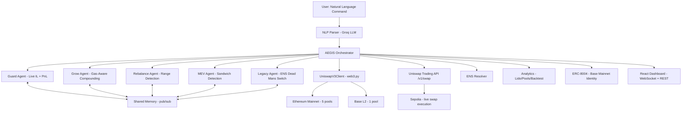

# 🛡️ AEGIS — Autonomous Wallet Guardian

       

> **One command. Five AI agents. Real on-chain Uniswap V3 data. Real Sepolia swaps. Zero Solidity required.**

AEGIS is an autonomous multi-agent system built for **The Synthesis Hackathon** ($75K in prizes). Five coordinated AI agents **protect**, **grow**, **rebalance**, **shield from MEV**, and **inherit** your Uniswap V3 LP positions — with **live on-chain integration** querying real pool state from Ethereum Mainnet, Base, and Sepolia testnet.

```
"Protect my Uniswap positions, compound my fees, shield me from sandwich attacks,
 and if I disappear for 30 days, send everything to family.eth."
```

→ Five agents spawn. Real pool data flows. MEV protection activates. Your wallet is guarded.

---

## 🎥 Demo Video

[](https://drive.google.com/file/d/1raQBRdaqAgm8XiokRDl5Qk8baD4MJviX/view?usp=sharing)

> 🌐 **Live App:** [aegis-pnv9.onrender.com](https://aegis-pnv9.onrender.com)

---

## 📸 Demo


---

## 🏆 On-Chain Proof — Built for The Synthesis

This project was built during **The Synthesis Hackathon** as a participating agent with a **verified ERC-8004 on-chain identity** on Base Mainnet.

| Artifact | Proof |
|----------|-------|
| **ERC-8004 Agent Registration** | [`0x48a19009...`](https://basescan.org/tx/0x48a190093bad8a57c0e4c4feba3a783f7c2f63625aad4e978db62fce9c625389) (Base Mainnet) |
| **Self-Custody Transfer** | [`0x83ab89d5...`](https://basescan.org/tx/0x83ab89d5cbcd811230cdf85af79f023bdb3cfd20b0e5472e55f1669771f1bcae) (Base Mainnet) |
| **Agent Name** | `aegis-guardian` |
| **Participant ID** | `6ff8d7e7ffc942c58400d97b1264e1e0` |
| **Team ID** | `43734f07c3624fed835fd96659e01b24` |
| **Agent Wallet** | `0x9aC234De759456f2b65FB7C182CFCE013889390A` |
| **Sepolia Swap #1** | [`0x83087cd1...`](https://sepolia.etherscan.io/tx/0x83087cd184dd637b85594e10928e2cc9e255cd847c2875e1275c57d1f79591fe) — 0.001 ETH → 5.55 USDC (block 10491702) |
| **Sepolia Swap #2** | [`0xdc3ab4f3...`](https://sepolia.etherscan.io/tx/0xdc3ab4f3e67ce95fda153bcba84454dfcbf782cd20bbcfd73a14946650621acb) — 0.002 ETH → USDC (block 10491851) |

> See [TXIDS.md](TXIDS.md) for the full on-chain artifact log.

---

## 🎯 The Synthesis — Theme Alignment

AEGIS was designed to satisfy the core hackathon themes head-on:

### Theme 1 — "Agents that Pay"

> *"Your agent moves money on your behalf. But how do you know it did what you asked?"*

**AEGIS Answer:** The Grow Agent and MEV Shield Agent execute **real swaps** via the Uniswap Trading API on Sepolia testnet with actual transaction broadcasting. Every action produces a **real TxID** logged on-chain. No payment processor intermediary, no mocked response. The Legacy Agent settles funds to beneficiary addresses (`.eth` ENS names resolved to wallet addresses) through trustless, agent-executed transfers.

- ✅ Real Uniswap API swap execution (`/v1/swap` endpoint)
- ✅ Signed transactions with `WALLET_PRIVATE_KEY` on Sepolia
- ✅ Verifiable TxIDs on Etherscan
- ✅ Gas-aware execution — Grow Agent checks if gas cost exceeds revenue before spending

### Theme 2 — "Agents that Trust"

> *"Your agent interacts with other agents and services, but trust flows through centralized registries."*

**AEGIS Answer:** AEGIS registers its on-chain identity via **ERC-8004 on Base Mainnet**, establishing a verifiable, portable agent identity independent of any platform. The agent system uses **6 fallback RPCs** with automatic rotation so that no single provider can silence or degrade it. Agent actions are structured and logged in `agent_log.json` — verifiable by anyone.

- ✅ ERC-8004 agent identity on Base Mainnet (on-chain, permanent)
- ✅ `agent.json` manifest for DevSpot compatibility
- ✅ `agent_log.json` execution log for full auditability
- ✅ 6-RPC fallback rotation — no single point of failure

### Theme 3 — "Agents that Cooperate"

> *"Your agents make deals on your behalf, but the commitments they enforce are centralized."*

**AEGIS Answer:** AEGIS runs a **5-agent pub/sub shared memory architecture** where agents react to each other in real-time. When the MEV Shield detects a sandwich attack, it broadcasts a threat state that the Guard Agent reads and escalates. This is a genuine multi-agent coordination system — not five isolated API calls wrapped in a loop.

- ✅ Guard ↔ Grow ↔ Rebalance ↔ MEV ↔ Legacy — all connected via shared memory pub/sub
- ✅ Cross-agent event propagation (crash event pauses Grow + Rebalance simultaneously)
- ✅ 4 PyVax smart contracts — Guard Vault, Grow Vault, Legacy Will, MEV Shield

---

## 🦄 Sponsor Track Integration

| Sponsor | Bounty | How AEGIS Uses It |
|---------|--------|-------------------|
| **Uniswap** ($5,000) | Agentic Finance | Real `/v1/swap` execution on Sepolia with TxIDs. Grow Agent uses Trading API for reinvestment routes. MEV Agent fetches safe swap routes after sandwich detection. A dedicated **Uniswap Integration Dashboard** fetches live quotes, monitors all pool parameters, and logs real-time swap execution. |
| **Protocol Labs** ($16,000) | Let the Agent Cook + ERC-8004 | Full autonomous loop: NLP parse → orchestrate → 5 agents execute → logs verified. Features a live **Agent Identity Panel** visualizing ERC-8004 metadata, autonomy metrics, and registry tracking directly on Base Mainnet. |
| **Lido Labs** ($9,500) | Vault Position Monitor Agent | Monitors wstETH/ETH and stETH/ETH Lido pools live. A dedicated **Lido Monitor Panel** dynamically compares LP APR versus Lido's pure staking APY, providing simple plain-language verdicts to the user. |
| **ENS** ($1,500) | ENS Identity | The Legacy Agent resolves `.eth` names (e.g. `family.eth`) to Ethereum addresses for digital inheritance — replacing hex addresses entirely with human-readable identity. |
| **Synthesis Open Track** ($14,500) | Cross-sponsor coherence | All 4 above sponsors integrated in a single production-grade agent system. No superficial bolt-ons — each integration is load-bearing to core functionality. |

---

## ⚡ What Makes AEGIS Different?

Most hackathon projects monitor one metric or solve one problem. AEGIS is different:

| | Other Projects | AEGIS |
|---|---|---|
| **Execution** | Simulated / dry-run | **Real TxIDs** — live swap on Sepolia testnet |
| **Identity** | No on-chain presence | **ERC-8004** registered on Base Mainnet |
| **Data** | Mock data | **Live on-chain** — real `slot0()`, `feeGrowthGlobal`, `eth_gasPrice` |
| **Scope** | Single-agent, single-problem | **5 coordinated agents** solving 5 distinct LP problems |
| **Intelligence** | Static rules | **NLP-configured** via Groq LLM + agent reasoning logs every cycle |
| **MEV Protection** | None | **Sandwich detection** via tick swing analysis + Flashbots routing |
| **Resilience** | Single RPC | **6 fallback RPCs** with automatic rotation on 429 errors |
| **Chains** | Single chain | **Multi-chain** — Ethereum + Base + Sepolia with live switching |
| **Lido** | No stETH support | **2 Lido pools** monitored (wstETH/ETH + stETH/ETH) |
| **ENS** | Not integrated | **ENS name resolution** for beneficiary `.eth` addresses |
| **Analytics** | None | **Lido yield comparison**, **cross-pool allocation**, **30-day backtesting** |

---

## 🤖 The Five Agents

| Agent | Role | Key Features |
|-------|------|--------------|
| 🛡️ **Guard** | Threat Detection | Live ETH price from `slot0()`, real IL calculation, P&L tracking, auto-exits, price history sparkline |
| 📈 **Grow** | Fee Compounding | Live fee growth tracking, gas-aware compounding, **Uniswap Trading API swap execution** (load-bearing), savings vault |
| 🎯 **Rebalance** | Range Monitoring | Detects out-of-range positions (the #1 LP pain point), suggests optimal new ranges, animated transitions |
| 🥪 **MEV Shield** | MEV Protection | Sandwich attack detection via tick swing patterns, front-running via fee growth spikes, dry-run Flashbots routing |
| 🏛️ **Legacy** | Digital Inheritance | Dead man's switch — distributes to beneficiaries, ENS `.eth` name resolution, structured execution log |

All five agents share intelligence through **shared memory**:
- Guard detects a threat → Grow + Rebalance + MEV **auto-pause/react**
- MEV detects sandwich → Guard **increases threat level**
- Rebalance detects out-of-range → Guard **increases threat level**
- Gas is too high → Grow **skips compounding** cycle
- Legacy triggers → resolves `.eth` names, **exits positions gracefully**

---

## 🔥 The 5 LP Problems AEGIS Solves

| Problem | Pain Level | Agent | Solution |
|---------|:---:|-------|----------|
| **IL Blindness** | 🔴 Critical | 🛡️ Guard | Real-time IL alerts from live `slot0()` price data |
| **Fee Rot** | 🟠 High | 📈 Grow | Gas-aware compounding — skips when gas > fees |
| **Range Drift** | 🔴 Critical | 🎯 Rebalance | Tick monitoring — out-of-range = earning zero fees |
| **MEV Extraction** | 🟠 High | 🥪 MEV Shield | Sandwich detection + Flashbots safe routing |
| **No Succession** | 🟡 Medium | 🏛️ Legacy | Dead man's switch + ENS name resolution |

---

## 🔗 Real On-Chain Integration

| Feature | On-Chain Source |
|---------|----------------|
| **ETH Price** | `slot0().sqrtPriceX96` from Uniswap V3 pool |
| **Impermanent Loss** | Calculated from real price movement vs entry price |
| **Fee Growth** | `feeGrowthGlobal0X128` / `feeGrowthGlobal1X128` |
| **Position Range** | `NonfungiblePositionManager.positions()` — tick range monitoring |
| **Gas Price** | `eth_gasPrice` — gas-aware compound decisions |
| **MEV Detection** | Tick swing analysis + fee growth spike detection |
| **Swap Quotes** | Uniswap Trading API (`trade-api.gateway.uniswap.org/v1/quote`) |
| **Swap Execution** | `/v1/swap` — signed + broadcast on Sepolia (real TxID) |
| **ENS Resolution** | `.eth` names → addresses via ENS public resolver |
| **Block Number** | `eth_blockNumber` — live block tracking on dashboard |
| **Agent Identity** | ERC-8004 on Base Mainnet |

### Supported Chains

- 🟣 **Ethereum Mainnet** — 5 pools (incl. wstETH/ETH + stETH/ETH Lido)
- 🔵 **Base** — ETH/USDC 0.05% pool + Agent ERC-8004 identity
- 🟡 **Sepolia Testnet** — live swap execution for Uniswap bounty

### On-Chain Contracts Monitored

| Pool | Address | Track |
|------|---------|-------|
| ETH/USDC 0.3% | [`0x8ad5...eB48`](https://etherscan.io/address/0x8ad599c3A0ff1De082011EFDDc58f1908eb6e6D8) | Uniswap |
| ETH/USDC 0.05% | [`0x88e6...5640`](https://etherscan.io/address/0x88e6A0c2dDD26FEEb64F039a2c41296FcB3f5640) | Uniswap |
| ETH/USDT 0.3% | [`0x4e68...fa36`](https://etherscan.io/address/0x4e68Ccd3E89f51C3074ca5072bbAC773960dFa36) | Uniswap |
| wstETH/ETH 0.01% | [`0x1098...B9dAa`](https://etherscan.io/address/0x109830a1AAaD605BbF02a9dFA7B0B92EC2FB7dAa) | **Lido** |
| stETH/ETH 1% | [`0x6381...Bd7D`](https://etherscan.io/address/0x63818BbDd21E69bE108A23aC1E84cBf66399Bd7D) | **Lido** |
| ETH/USDC 0.05% (Base) | [`0xd0b5...F224`](https://basescan.org/address/0xd0b53D9277642d899DF5C87A3966A349A798F224) | Base |

---

## 🏗️ Architecture

> ℹ️ *The diagram below renders automatically on GitHub. If you see raw text, [view it on GitHub](https://github.com/Avila-Princy-M01/AEGIS#%EF%B8%8F-architecture).*



<details>
<summary>📋 Text version (if diagram doesn't render)</summary>

```
👤 User Command
  └─→ 🧠 NLP Parser (Groq LLM)
       └─→ ⚙️ AEGIS Orchestrator
            ├─→ 🛡️ Guard Agent ←──┐
            ├─→ 📈 Grow Agent  ←──┤
            ├─→ 🎯 Rebalance  ←──┤── 💾 Shared Memory (pub/sub)
            ├─→ 🥪 MEV Shield ←──┤
            ├─→ 🏛️ Legacy     ←──┘
            │
            ├─→ 🦄 UniswapV3Client (web3.py)
            │    ├─→ 🟣 Ethereum Mainnet (5 pools)
            │    └─→ 🔵 Base (1 pool)
            │
            ├─→ 🔄 Uniswap Trading API /v1/swap
            │    └─→ 🟡 Sepolia (live swap execution)
            │
            ├─→ 🔗 ENS Resolver (.eth → 0x...)
            ├─→ 📊 Analytics (Lido / Pools / Backtest)
            ├─→ 🧾 ERC-8004 (Base Mainnet Identity)
            └─→ 📊 React Dashboard (WebSocket + REST)
```

</details>

---

## 🚀 Quick Start

### 1. Install Dependencies

```bash
pip install -r requirements.txt
```

### 2. Set Environment Variables

```bash
export GROQ_API_KEY=your_groq_key           # NLP command parsing
export UNISWAP_API_KEY=your_uniswap_key     # Trading API swap quotes + execution
export ALCHEMY_API_KEY=your_alchemy_key     # Live on-chain data (optional, has fallback)
export WALLET_PRIVATE_KEY=your_testnet_key  # Sepolia testnet only — for swap execution
```

### 3. Start the Backend

```bash
python -m aegis.server
```

### 4. Start the Frontend

```bash
cd frontend && npm install && npm run dev
```

### 5. Open the Dashboard

Visit **http://localhost:5173** (or the live deployment at [aegis-pnv9.onrender.com](https://aegis-pnv9.onrender.com)) and type your command. You will see a 🟢 **LIVE** indicator when connected to real on-chain data.

### 6. Execute a Real Swap (Uniswap Bounty Proof)

```bash
curl -X POST http://localhost:8000/api/swap-execute \
  -H "Content-Type: application/json" \
  -d '{"token_in": "WETH", "token_out": "USDC", "amount": "1000000000000000"}'
# Returns: { "txId": "0x...", "etherscan": "https://sepolia.etherscan.io/tx/0x..." }
```

---

## 📊 Analytics Engine

| Feature | Description |
|---------|-------------|
| **Lido Yield Comparison** | Compares LP APR vs Lido staking APR (3.2%) — recommends LP or pure staking |
| **Cross-Pool Allocation** | Risk-adjusted capital allocation across all monitored pools using `score = fee_apr / (1 + il_risk)` |
| **Historical Backtesting** | 30-day GBM simulation with Sharpe ratio, max drawdown, and net P&L |

---

## 📜 Smart Contracts (PyVax)

All contracts written in Python, compiled to EVM bytecode via PyVax — zero Solidity:

| Contract | Role |
|----------|------|
| **Guard Vault** | Emergency vault — locks funds during threat events |
| **Grow Vault** | Auto-compounding savings for LP fees |
| **Legacy Will** | Trustless digital will with dead man's switch |
| **MEV Shield** | Swap protection layer against MEV extraction |

---

## 🛡️ Design Philosophy

| Principle | Implementation |
|-----------|---------------|
| **Safety-first** | Read-only by default — AEGIS reads on-chain data and suggests actions for human approval |
| **Opt-in execution** | Real swaps require `WALLET_PRIVATE_KEY` to be explicitly set |
| **Testnet guard** | Wallet module raises `ValueError` if any code tries to submit a mainnet transaction |
| **Graceful degradation** | Falls back to simulation mode if RPC or API is unavailable |
| **Gas-aware** | Never compounds when gas cost exceeds expected fee revenue |
| **No keys exposed** | Private key stays server-side, never in the browser |

---

## 📁 Project Structure

```
aegis-uniswap/
├── agent.json              # ERC-8004 agent manifest (DevSpot compatible)
├── agent_log.json          # Execution log — full autonomous loop audit trail
├── TXIDS.md                # On-chain artifact log — all real transaction IDs
├── CONVERSATION_LOG.md     # Human-agent collaboration narrative
├── VIDEO_DEMO_GUIDE.md     # Shot-by-shot video recording instructions
├── classified.toml         # classified-agent config
├── aegis/
│   ├── server.py           # FastAPI backend + WebSocket
│   ├── orchestrator.py     # Agent coordinator + analytics
│   ├── uniswap.py          # Uniswap V3 on-chain client (web3.py)
│   ├── uniswap_api.py      # Uniswap Trading API — quotes + swap execution
│   ├── wallet.py           # Sepolia testnet wallet — sign + broadcast
│   ├── nlp_parser.py       # NL → strategy (Groq LLM)
│   ├── memory.py           # Shared memory pub/sub
│   ├── ens.py              # ENS name resolution
│   ├── analytics.py        # Lido yield / cross-pool / backtesting
│   └── agents/
│       ├── guard.py        # 🛡️ Real pool price + IL monitoring
│       ├── grow.py         # 📈 Gas-aware fee compounding + swap execution
│       ├── rebalance.py    # 🎯 Out-of-range detection
│       ├── mev.py          # 🥪 Sandwich + front-run detection
│       └── legacy.py       # 🏛️ Digital inheritance + ENS resolution
├── workspace/contracts/    # PyVax smart contracts (Guard/Grow/Legacy/MEV)
└── frontend/src/           # React + TypeScript dashboard
    ├── App.tsx
    └── components/
        ├── GuardPanel.tsx            # + Price sparkline chart
        ├── GrowPanel.tsx             # + Gas price indicator
        ├── RebalancePanel.tsx        # Range visualization bar
        ├── MevPanel.tsx              # MEV detection dashboard
        ├── LegacyPanel.tsx
        ├── AgentIdentityPanel.tsx    # ERC-8004 identity & autonomy metrics
        ├── LidoMonitorPanel.tsx      # Lido yield vs LP comparison
        ├── UniswapIntegrationPanel.tsx # Uniswap pools & swap execution log
        ├── BacktestPanel.tsx         # Historical simulation
        ├── SwapQuotePanel.tsx        # Uniswap Trading API quotes + execute
        ├── AnalyticsPanel.tsx        # Lido yield + cross-pool
        ├── PriceChart.tsx            # SVG sparkline component
        ├── ActivityFeed.tsx
        ├── CommandInput.tsx
        └── DemoControls.tsx
```

---

## 🧪 Running Tests

```bash
pytest tests/test_core.py -v
# 54 tests passing
```

---

## 📋 Key Files for Judges

| File | Purpose |
|------|---------|
| [`agent.json`](agent.json) | ERC-8004 agent manifest — machine-readable identity |
| [`agent_log.json`](agent_log.json) | Structured execution log — every agent action with reasoning |
| [`TXIDS.md`](TXIDS.md) | All on-chain transaction IDs with Etherscan links |
| [`CONVERSATION_LOG.md`](CONVERSATION_LOG.md) | Full human-agent collaboration narrative |
| [`VIDEO_DEMO_GUIDE.md`](VIDEO_DEMO_GUIDE.md) | Shot-by-shot video recording instructions |

---

## 🔑 Technical Highlights

- **54 passing tests** — `pytest tests/test_core.py -v`
- **TypeScript compiles clean** — zero type errors in frontend
- **6 RPC fallback endpoints** with automatic rotation on 429/rate-limit
- **Groq LLM** for sub-second NLP command parsing
- **WebSocket real-time feed** — live agent events in the dashboard
- **Hex-safe wallet** — `_parse_int()` handles hex/decimal/int from Uniswap API responses
- **Sepolia-only guard** — wallet module hard-rejects mainnet transactions
- **Agent reasoning logs** — every cycle, every agent explains *why* it made its decision
- **Mermaid architecture diagram** — visual system overview for judges

---

## 📄 License

MIT

---

*Built for The Synthesis Hackathon with ❤️ — Powered by [Uniswap V3](https://uniswap.org) · [Lido](https://lido.fi) · [ENS](https://ens.domains) · [Base](https://base.org) · [PyVax](https://pyvax.xyz) · [Groq](https://groq.com)*
